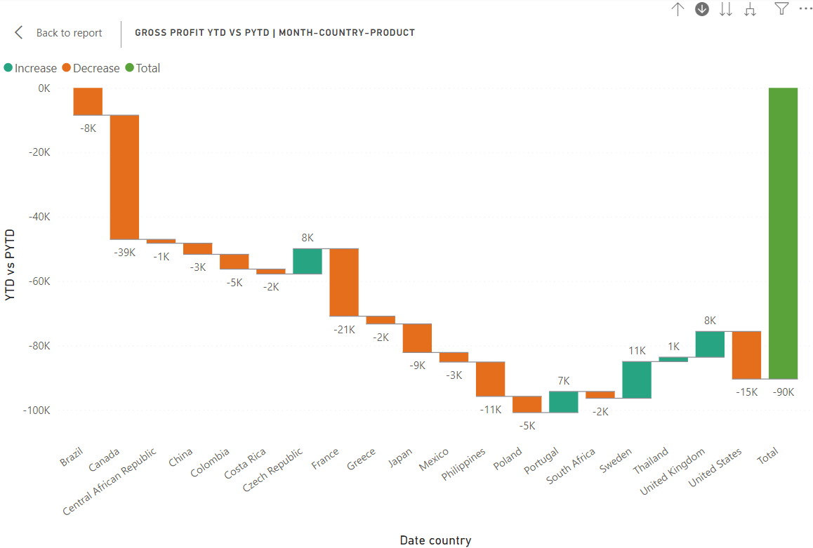

# Plant Co. Performance Analysis Report 

## Introduction
This Power BI project is centered on analyzing the business performance of Plant Co. for the year 2024, specifically focusing on key metrics such as sales, quantity, and gross profit. Through comprehensive data cleaning, transformation, and the creation of dynamic visualizations, the project aims to provide a detailed view of the company's financial and operational outcomes. By leveraging advanced measures and calculated columns, the analysis offers a comparative assessment of year-to-date (YTD) and previous year-to-date (PYTD) performance, enabling Plant Co. to gain valuable insights into its business trends and performance.
## Objective
The primary objective of this project is to provide an in-depth analysis of Plant Co.'s sales, quantity, and gross profit for 2024. The project aims to create a comprehensive dashboard in Power BI that dynamically visualizes key business metrics, facilitating a comparison between current and previous performance periods. By doing so, the project seeks to deliver actionable insights into the company's financial health, identify areas of strength and improvement, and support strategic decision-making.
## Overview
This Power BI project focuses on analysing the performance of Plant Co. in terms of sales, quantity, and gross profit for the year 2024. The analysis involves data cleaning, transformation, and the creation of dynamic visualizations to present key business metrics. The project includes detailed measures and calculated columns to provide insights into the company's year-to-date (YTD) and previous year-to-date (PYTD) performance.
## Project Structure
1. **Data:** Power Query Virtual Tables

2. **Model:** Measures calculated column

3. **Visuals:** Layout Design

4. **Review:** Publish	
## Task
1. Dim_Date Table Creation

2. Value Table Creation

3. Measure Table Creation and Grouping

4. Design Dashboard Visualizations

5. Enable Dashboard Interactivity and add Slicers

## Data & Resource Used

**Dataset**

Option 1: [Kaggle](https://www.kaggle.com/datasets?fileType=csv)

Option 2: And, also the dataset can be found on [Mo Chen](https://www.youtube.com/@mo-chen) YouTube Channel. I am grateful for his wife guidance on this project.

**Tools and Technologies** 

•	Power BI Function Library: DAX

•	Tool: Microsoft Excel, Power BI

## Methodology

The methodology involved several steps to explore and analyze the Plant.Co dataset:

### 1. Dim_Date Table Creation

o A new table, Dim_Date, was created using DAX formulas, containing two columns: date and Inpast. This table is used for time-based analysis.

### 2. Value Table Creation

o A value table named Slc_Values was created with a column named VALUES to support dynamic selection in visualizations.

### 3. Measure Table Creation and Grouping

o	A dedicated table _Measures was created to calculate and store various key metrics:

**Measures**

1. Sales

2. Quantity

3. COGs (Cost of Goods Sold)

4. Gross Profit

5. Previous Year-to-Date (PYTD) Measures

6. Year-to-Date (YTD) Measures

7. Switch Measures

8. Gross Profit Percentage (GP%) Calculation

9. Dynamic Title Measure
### 4. Design Dashboard Visualizations
**Card Visuals:**

o	Dynamic cards were created to display metrics such as Sales/Quantity/Gross Profit for YTD, YTD vs. PYTD, PYTD, and GP%. The content displayed is based on the selection in the slicers.

**Waterfall Chart:**

o	A waterfall chart was designed to showcase the comparison of Sales/Quantity/Gross Profit YTD vs. PYTD, segmented by Month, Country, and Product.

**Scatter Plot:**

o	A scatter plot was developed for Account Profitability Segmentation, showcasing the relationship between GP% and Sales.

**Tree Map:**

o	A tree map visual was created to highlight the Bottom 10 Sales YTD vs. PYTD by Country.

**Line and Stacked Column Chart:**

o	This visualization displays dynamic Sales/Quantity/Gross Profit for YTD and PYTD, broken down by month.

### 5. Enable Dashboard Interactivity and add Slicers
**Slicers:**

o	A slicer was added for the VALUES column in the Slc_Values table to allow users to dynamically switch between Sales, Quantity, and Gross Profit.

o	Another slicer was added for date selection, specifically focusing on years.

**Dynamic Title Measure:**

o	A dynamic title measure was created for all charts, reflecting the selected metric from the VALUES slicer (Sales, Quantity, Gross Profit).

## Data Analysis & Key Findings
### 1. Gross Profit 2024
**Insight:**
o A detailed summary of Gross Profit for 2024, highlighting significant trends and observations. Notably, there was a major decline in Gross Profit during March and April, warranting further investigation into potential causes.

o If we want to look at April. We can straight away see Canada is contributing a majority to these declines versus prior YTD and a majority of it is coming from landscape going in we can see exactly what it is so straight away I’m getting value in this.

### 2. Month by Month 
**Insight:** 

o A comprehensive summary detailing the performance of Sales, Quantity, and Gross Profit on a monthly basis. This includes a breakdown of key drivers for increases or decreases in these metrics.

o We can see February that was our biggest month and it exceeded a prior to date what we were doing last this same period last year. So February is a good month.

 

### 3. Bottom 10 Gross Profit YTD vs PYTD by Country

 

### 4. Account Profitability by Segmentation by GP% & Gross Profit  

### 5. Final Dashboard 
A Condensed, dynamic performance report that utilises SWITCH Measures and Conditional formatting.

## Conclusion
This project provides a thorough analysis of Plant Co.'s performance metrics for 2024, utilizing advanced data visualization techniques in Power BI. The inclusion of dynamic measures and interactive elements enables stakeholders to gain deep insights into business performance, identify trends, and make data-driven decisions. The detailed analysis and visualizations effectively communicate the business's financial health and operational efficiency, making it an invaluable tool for strategic planning and management review.
## Recommended Analysis
For future analyses, it is recommended to:

**Trend Analysis:** Extend the analysis to include monthly and quarterly trends to better understand seasonal variations and identify peak performance periods.

**Customer Segmentation:** Analyze customer demographics and purchasing behaviors to identify high-value customer segments and tailor marketing strategies accordingly.

**Product Performance Analysis:** Conduct a detailed assessment of individual product performance, including profitability, market share, and lifecycle stage.

**Forecasting and Predictive Analytics:** Implement predictive analytics models to forecast future sales and gross profit, aiding in inventory planning and financial forecasting.	
## Reflection
This project demonstrates the power of Power BI as a tool for transforming raw data into meaningful business insights. By focusing on key financial metrics and providing a detailed comparison of YTD and PYTD performance, the analysis offers a clear and actionable understanding of Plant Co.'s business outcomes. The use of dynamic visualizations not only enhances the comprehensibility of the data but also allows for interactive exploration, empowering stakeholders to make informed decisions. The project's structured approach to data cleaning and transformation ensures data accuracy and reliability, highlighting the importance of robust data management practices in business analysis.
